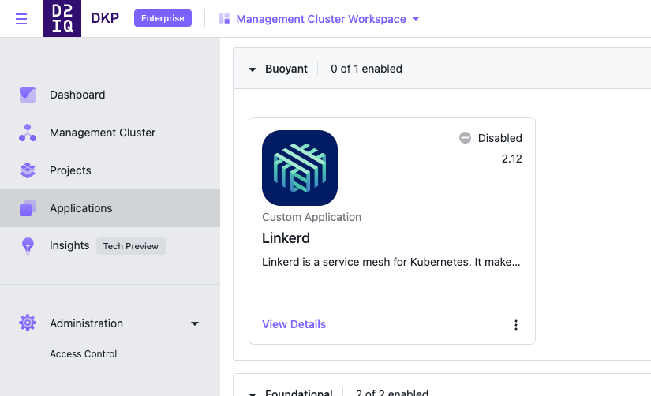

# linkerd-demo-catalog
## This is a custom catalog for Linkerd for Kommander



This catalog item provides a full Linkerd stack to be used for DEMO purposes when showcasing DKP and Linkerd together.

Please see [Linkerd Catalog Github Page](https://github.com/phenderson-d2iq/linkerd-catalog) for a non-DEMO Linkerd catalog.

To add the Linkerd DEMO catalog to DKP,  run the following:

```
kubectl apply -f - <<EOF
apiVersion: source.toolkit.fluxcd.io/v1beta1
kind: GitRepository
metadata:
  name: linkerd-demo-catalog-repo
  namespace: kommander
  labels:
    kommander.d2iq.io/gitapps-gitrepository-type: catalog
    kommander.d2iq.io/gitrepository-type: catalog
spec:
  interval: 1m0s
  ref:
    branch: main
  timeout: 20s
  url: https://github.com/phenderson-d2iq/linkerd-demo-catalog
EOF
```

